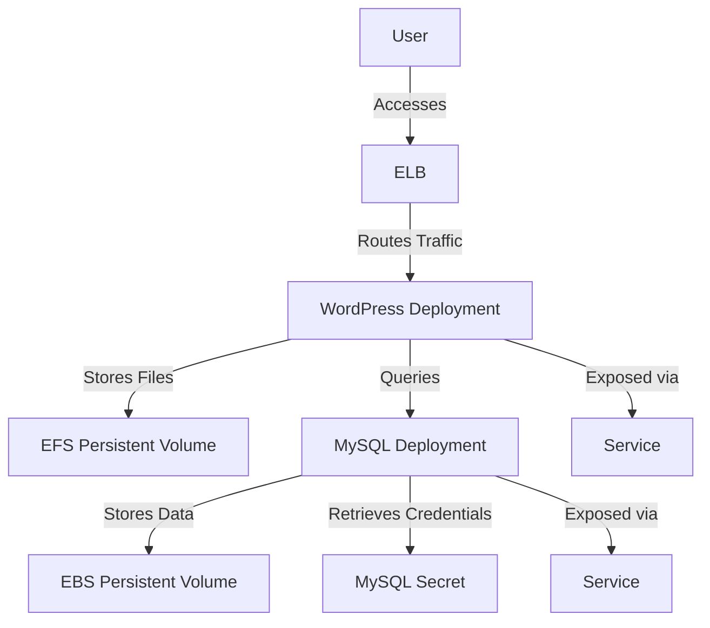

# 🌟 Cloud-Native WordPress Deployment on AWS using Kubernetes & MySQL
**A scalable and highly available WordPress deployment on AWS, leveraging Kubernetes, MySQL, and Elastic Load Balancer for seamless performance and reliability.**

---

## 🏆 Core Advantages
- **Scalability & High Availability** - Kubernetes ensures auto-scaling and load balancing.
- **Persistent Storage** - EBS for MySQL and EFS for WordPress files.
- **Security Best Practices** - Secrets management and IAM policies.
- **Automated Deployment** - Seamless Kubernetes deployment with ELB.
- **Optimized Performance** - Efficient database and storage configuration.

## 🛠️ Technical Components
| Layer              | AWS Services                          |
|---------------------|---------------------------------------|
| **Compute**       | Amazon EC2, Kubernetes (EKS)          |
| **Networking**      | Elastic Load Balancer (ELB), VPC      |
| **Storage**         | EBS (MySQL), EFS (WordPress)         |
| **Database**        | MySQL                                |
| **Orchestration**   | Kubernetes                     |
| **Monitoring**      | CloudWatch     |

## 📂 Project Structure

Cloud-Native-WordPress-Deployment/
- ├── Kubernetes/         # Kubernetes manifests
- │   ├── wordpress-deployment.yaml
- │   ├── mysql-deployment.yaml
- │   ├── service.yaml
- │   ├── ingress.yaml
- │
- ├── Storage/            # Persistent storage configuration
- │   ├── efs-pv.yaml
- │   ├── ebs-pv.yaml
- │
- ├── Config/             # Secret and ConfigMap
- │   ├── mysql-secret.yaml
- │   ├── wordpress-configmap.yaml
- │
- ├── README.md           # Project Documentation

## 🛠️ Technical Implementation
### 🏗️ Kubernetes Deployment Architecture

## 🤝 Connect with Me
- **LinkedIn**: [Ayman Mohamed](https://www.linkedin.com/in/ayman-mohamed1043/)
- **Notion**: [Project Documentation](https://yummy-success-abe.notion.site/Cloud-Native-WordPress-Deployment-on-AWS-using-Kubernetes-MySQL-19fd1728bdbc80849ff5e8ed8d1734b2?pvs=4)
- **Kubernetes**: [Official Website](https://kubernetes.io/)
- **AWS**: [Amazon Web Services](https://aws.amazon.com/)

---
Thanks.

